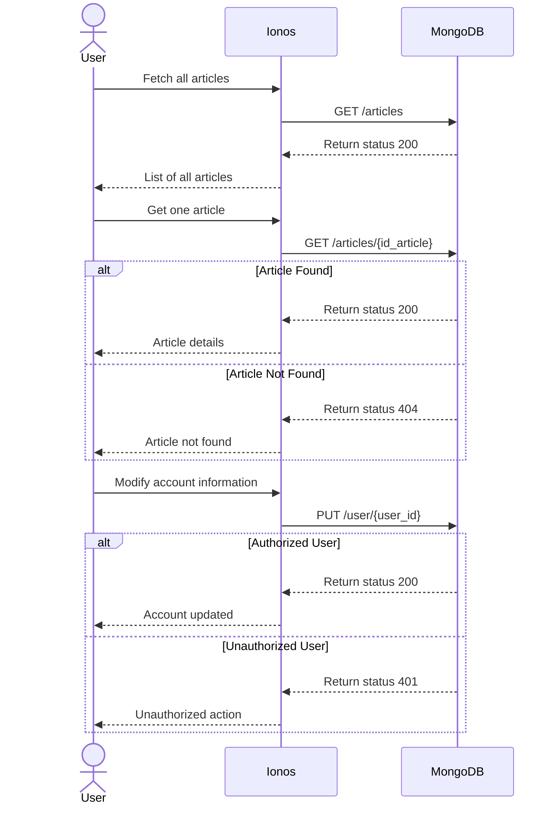
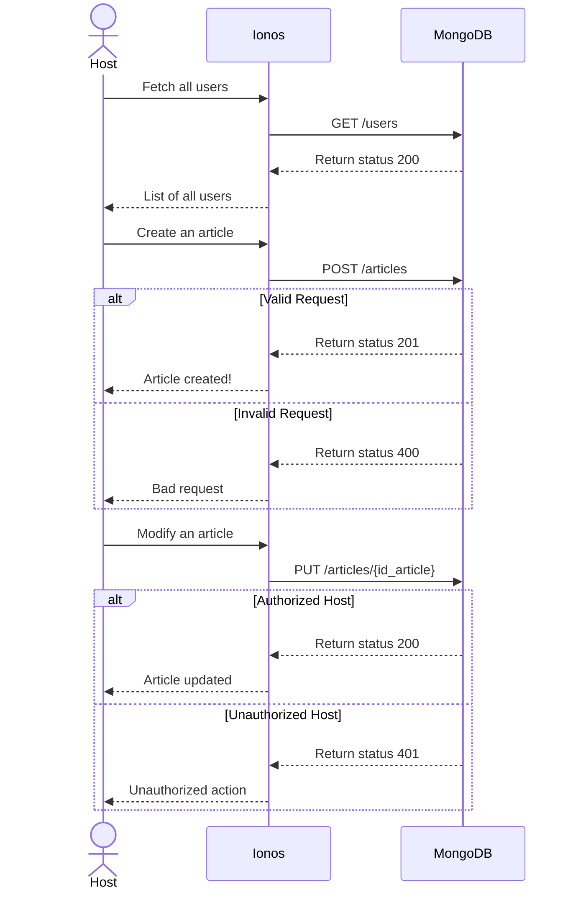

### Technical Documentation - Repaire des 2 Vallées 

---

# User Stories and Mockups 📚

## Prioritized User Stories 🚀

### **Must Have** ✅

* **User Stories**:

  * 👤 *As a user, I want to sign up and log in so that I can securely access my account.*
  * 📰 *As a user, I want to browse the association's articles so that I can stay informed.*
  * 📅 *As a user, I want to see which activities/articles I am enrolled in so that I know when to attend.*
  * 🔔 *As a user, I want to receive notifications for activity/article deadlines so that I never miss anything.*

### **Should Have** 💡

* **User Stories**:

  * 💻 *As an administrator, I want to manage the association's articles so that I can edit or delete them if necessary.*
  * 🧑‍🔧 *As a user, I want to collaborate with others by sharing projects so that we can work efficiently together.*
  * 🕗 *As a user, I want to integrate my calendar with the application so that I can synchronize my tasks across platforms.*
  * 🎨 *As a user, I want to customize my profile so that I can make my experience more personal.*

### **Could Have** 🌟

* **User Stories**:

  * 🌃 *As a user, I want a dark mode so that I can use the application comfortably in low-light environments.*

### **Won’t Have (Excluded from MVP)** ❌

* **User Stories**:

  * 🎤 *As a user, I want to use voice commands to find an activity so that I can search without using the keyboard.*
  * 🤖 *As a user, I want an AI assistant to help clients so that it can assist them if they encounter problems on the site.*

---

## Main Screen Mockups 🎨

### 🏠 Home Screen

### 🔐 Login/Sign-Up Screen

### 📜 Articles Page Preview

---

# Design System Architecture 🖌️

* **Frontend**: HTML, CSS
* **Backend**: Node.js, Express
* **Database**: MongoDB
* **External APIs**: Ionos

---

# Components, Classes, and Database Design 📊

### **Database Schema**:

* **Admin**:

  * `firstName`, `lastName`, `email`, `phoneNumber`, `role`, `password`, `id_admin`, `created_at`, `updated_at`
* **User**:

  * `firstName`, `lastName`, `role`, `email`, `address`, `password`, `phoneNumber`, `id_user`, `created_at`, `updated_at`
* **Agenda**:

  * `title`, `description`, `day`, `image` (optional), `price`, `id_agenda`, `created_at`, `updated_at`, `created_by`
* **Article**:

  * `title`, `description`, `date`, `image` (optional), `creator`, `id_article`, `created_at`, `updated_at`, `created_by`, `category`
* **Children**:

  * `firstName`, `lastName`, `age`
* **Event**:

  * `title`, `date`, `created_at`, `updated_at`, `image`, `id_event`

---

# High-Level Sequence Diagrams 📊

### **User Interaction**

### **Host Interaction**

---

# Document External and Internal APIs 🔗

### **User APIs**

| **URL**               | **Method** | **Input** (JSON)                                        | **Output** (JSON)                               | **Description**     |
| --------------------- | ---------- | ------------------------------------------------------- | ----------------------------------------------- | ------------------- |
| `/api/user`           | POST       | `{ firstName, lastName, email, phoneNumber, password }` | `{ message: "Your account is created!" }`       | Create a new user   |
| `/api/auth/login`     | GET        | `{ email, password }`                                   | `{ token }`                                     | User login          |
| `/api/user/{id_user}` | PUT        | `{ firstName, lastName, email, phoneNumber, password }` | `{ message: "Your account has been updated." }` | Update user account |
| `/api/user/{id_user}` | DELETE     | `{ id_user }`                                           | `{ message: "Your account has been deleted." }` | Delete user account |
| `/api/articles`       | GET        | None                                                    | `{ articles: [...] }`                           | Get all articles    |

### **Admin APIs**

| **URL**                           | **Method** | **Input** (JSON)                                 | **Output** (JSON)                 | **Description**   |
| --------------------------------- | ---------- | ------------------------------------------------ | --------------------------------- | ----------------- |
| `/api/admin/user`                 | GET        | None                                             | `{ users: [...] }`                | View all users    |
| `/api/admin/article`              | POST       | `{ title, description, date, image (optional) }` | `{ message: "Article created!" }` | Create an article |
| `/api/admin/article/{id_article}` | PUT        | `{ title, description, date, image (optional) }` | `{ message: "Article updated!" }` | Update an article |
| `/api/admin/article/{id_article}` | DELETE     | `{ id_article }`                                 | `{ message: "Article deleted!" }` | Delete an article |

---

# Plan SCM and QA Strategies 🛠️

### **SCM Strategy**

* **Version Control**: Git
* **Branching Strategy**:

  * `main`: Stable, production-ready code
  * `development`: Integration branch for features/bug fixes
  * `feature/*`: Feature branches for individual tasks
  * `hotfix/*`: For urgent fixes
* **Commit Guidelines**: Use a standardized format, e.g., `feat: Add feature` or `fix: Correct issue`

### **Quality Assurance**

* **Testing Types**:

  * Unit Tests: Individual components (e.g., API endpoints)
  * Integration Tests: Modules working together
  * End-to-End Tests: User workflows
  * Manual Tests: Critical user flows/UI validation
* **Tools**:

  * W3C: HTML/CSS validation
  * Mocha: Backend testing
  * ESLint: Node.js linting
* **Environments**:

  * Test Environment: Automated/manual tests before deployment
  * Production Environment: Stable, fully tested code
* **Bug Tracking**: GitHub Issues for logging and resolution
* \*\*Release Management
* Maintain a changelog for each release, detailing new features, bug fixes, and improvements.

## Technical Justifications 🧐  

We goes with a classique technologie for these raison :
- Our client are a litle assiosiation
- If the client recrute a developper web the web site need to be simple
- The developper need to be simple
--- 
