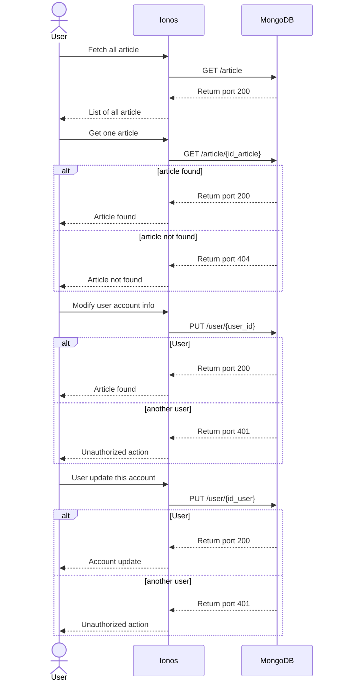
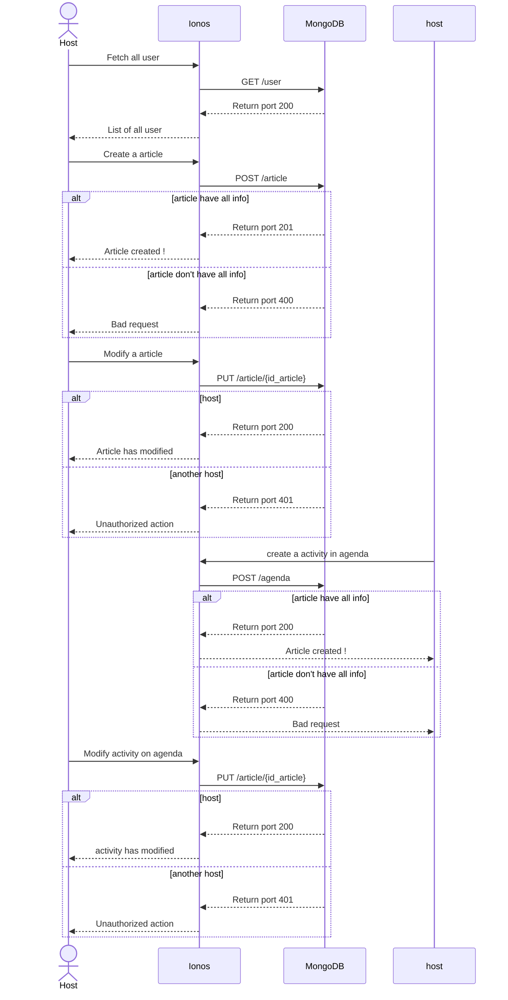
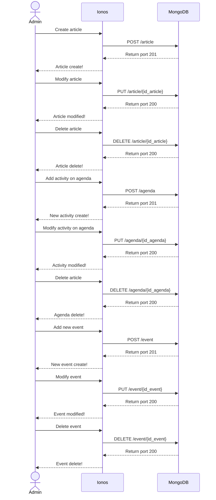

### Technical Documentation - Repaire des 2 Vallées 

# User Stories and Mockups 📖  

## Prioritized User Stories 🚀  

- **Must Have ✅**  
    - **User Story** :  
        - 👤 As a user, I want to sign up and log in so that I can securely access my account.  
        - 📰 As a user, I want to browse the association's articles so that I can stay informed, sign up, and log in.  
        - 📆 As a user, I want to see which activities/articles I am enrolled in so that I know when to attend.  
        - 🔔 As a user, I want to receive notifications for activity/article deadlines so that I never miss anything.  

- **Should Have 💡**  
    - **User Story** :  
        - 👨‍💻 As an administrator, I want to manage the association's articles so that I can edit or delete them if necessary.  
        - 🤝 As a user, I want to collaborate with others by sharing projects so that we can work efficiently together.  
        - 🗓️ As a user, I want to integrate my calendar with the application so that I can synchronize my tasks across platforms.  
        - 🎨 As a user, I want to customize my profile so that I can make my experience more personal.  

- **Could Have 🌟**  
    - **User Story** :  
        - 🌙 As a user, I want a dark mode so that I can use the application comfortably in low-light environments.  

- **Won’t Have (Excluded from MVP) ❌**  
    - **User Story** :  
        - 🎙️ As a user, I want to use voice commands to find an activity so that I can search without using the keyboard.  
        - 🤖 As a user, I want an AI assistant to help clients so that it can assist them if they encounter problems on the site.  

# Main Screen Mockups 🎨  
## For the user interface, here are the key screen mockups:  

### 🏠 Home Screen:  
  

### 🔐 Login/Sign-Up Screen:  
  

### 📄 Articles Page Preview:  
  

---

## Design System Architecture 🎨 

front-end : HTML, CSS
back-end : node.js and express
database: mangoDb
api external : Ionos

## Components, Classes, and Database Design 📊  

database :
- Admin : firstName, LastName, mail, PhoneNumber, rule, password, id_admin, creat at, update at
- User: nom, prenom, rule, mail, adress, password, PhoneNumber, id_User, creat at, update at
- Agenda: titre, description, day, image (optionnal), prix, id_agenda, creat at, update at, createby
- Article : titre, description, date, image (optionnal), creator, id_Article, creat at, update at, createby, category
- children: firstName, LastName, age
- event : title, date, creat at, update at, image, id_event

## High-Level Sequence Diagrams 📈  

### User diagram

### Host diagram

### Admin part

## Document External and Internal APIs 🔗

### **User part**

| **URL**  | **Method**      | **input** (json)                 | **Output** (json)  | Description|
|------------|-----------------|---------------------------------|--------------|------------|
|api/user|POST|``{FirstName, LastName, numero, adress, Password}``|``{message: "Your acount are created!"}``| Creation of a user|
|api/auth/login | GET | ``{Email, Password}``|``{token}``| connection user acount|
|api/user/{id_user}|PUT|``{FirstName, LastName, numero, adress, Password, id}``|``{message: ""Your information have been modified"}``| Modify user account|
|api/user/{id_user}|DELETE|``{id_user}``|``{message: "your acount are been delete"}``| Delete the user acount |
|api/article| GET ||``{list of article}``| Get all article |
|api/article/{id_article} |GET|``{id_Article}``|``{article}``|  Get a article with this id |
|api/agenda |GET||``{list of article}``| Get all activity on agenda |
|api/agenda/{id_agenda} |GET|``{id_Agenda}``|``{activity}``| Get activy on agenda with this id |
|api/event |GET||``{list of event}``| Get all event |
|api/event/{id_event} |GET|``{id_event}``|``{event}``| Get a event with this id |

### **Host and admin part**

| **URL**  | **Method**      | **input** (json)                 | **Output** (json)  | description|
|------------|-----------------|---------------------------------|--------------|------------|
|api/admin/user|GET||``{list of user}``| Admin see all user |
|api/admin/user/{id_user}|GET|``{id_user}``|``{User info}``| Admin see one user with this id|
|api/admin/user/{id_user}|PUT|``{FirstName, LastName, numero, adress, Password, id_User, id_admin}``| ``{message: "the user info have been modified"}``| admin modified the user data |
|api/admin/user/{id_user}|DELETE|``{id_user}``|``{message: "the acount user are delete"}``| Admin delete the user acount|
|api/admin/article| POST |``{titre, description, date, image (optionnal)}``|``{message: "Your article are create !"}``| Admin create a article |
|api/admin/article/{id_article} |PUT|``{titre, description, date, image (optionnal)}``|``{message: "Your article are update !"}``|Admin modified the article |
|api/admin/article/{id_article} |DELETE|``{id_Article}``|``{message: "Your article are delete!"}``|  Admin delete the article|
|api/admin/agenda |POST|``{titre, description, date, image (optionnal)}``|``{message: "Your activity are create !"}``| Admin create a activity on agenda |
|api/admin/agenda/{id_agenda} |PUT|``{id_Agenda, titre, description, date, image (optionnal)}``|``{message: "Your activity are update !"}``|Admin modified the activity agenda |
|api/admin/agenda/{id_agenda} |DELETE|``{id_Agenda}``|``{message: "Your activity are delete !"}``|  Admin delete activity on the agenda|
|api/event |GET||``{list of event}``| Get all event |
|api/event/{id_event} |GET|``{id_event}``|``{title, description, date, image}``| Get a event with this id |
|api/admin/event |POST|``{titre, description, date, image (optionnal)}``|``{message: "Your event are create !"}``| Admin create a event |
|api/admin/event/{id_event} |PUT|``{id_Agenda, titre, description, date, image (optionnal)}``|``{message: "Your event are update !"}``|Admin modified the event |
|api/admin/event/{id_event} |DELETE|``{id_Agenda}``|``{message: "Your event are delete !"}``|  Admin delete the event|

## Plan SCM and QA Strategies 🛠️  

## Technical Justifications 🧐  

We goes with a classique technologie for these raison :
- Our client are a litle assiosiation
- If the client recrute a developper web the web site need to be simple
- The developper need to be simple
--- 
