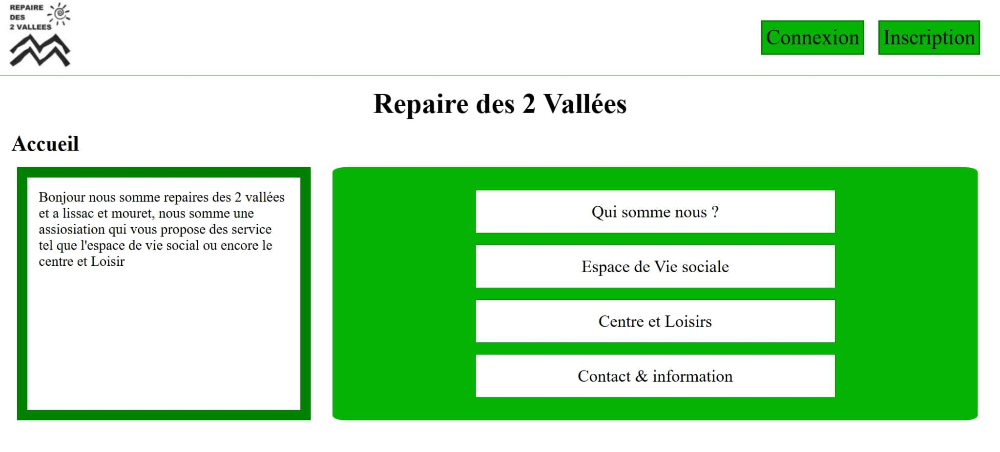
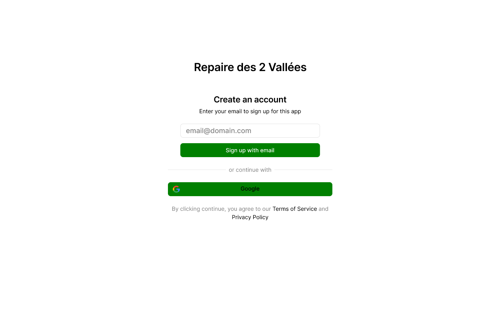
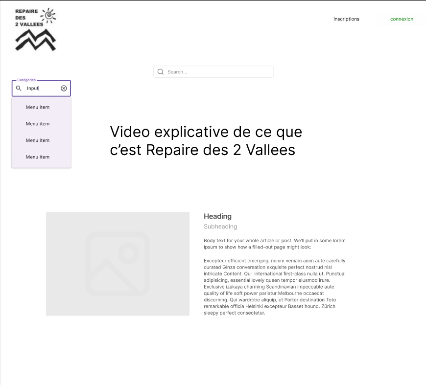
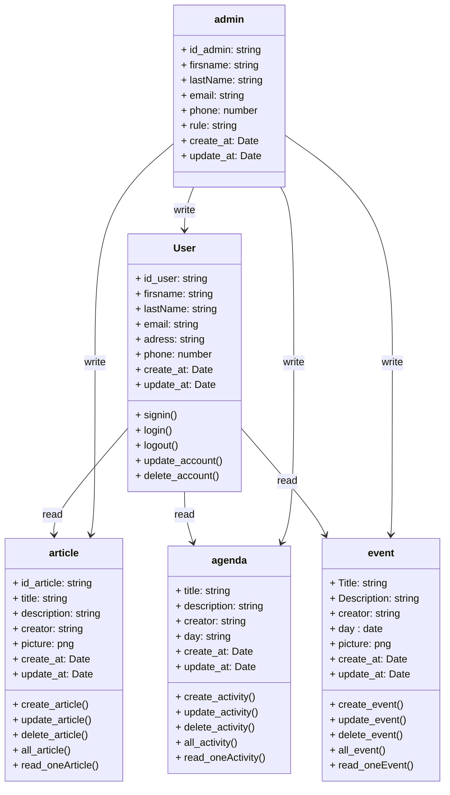
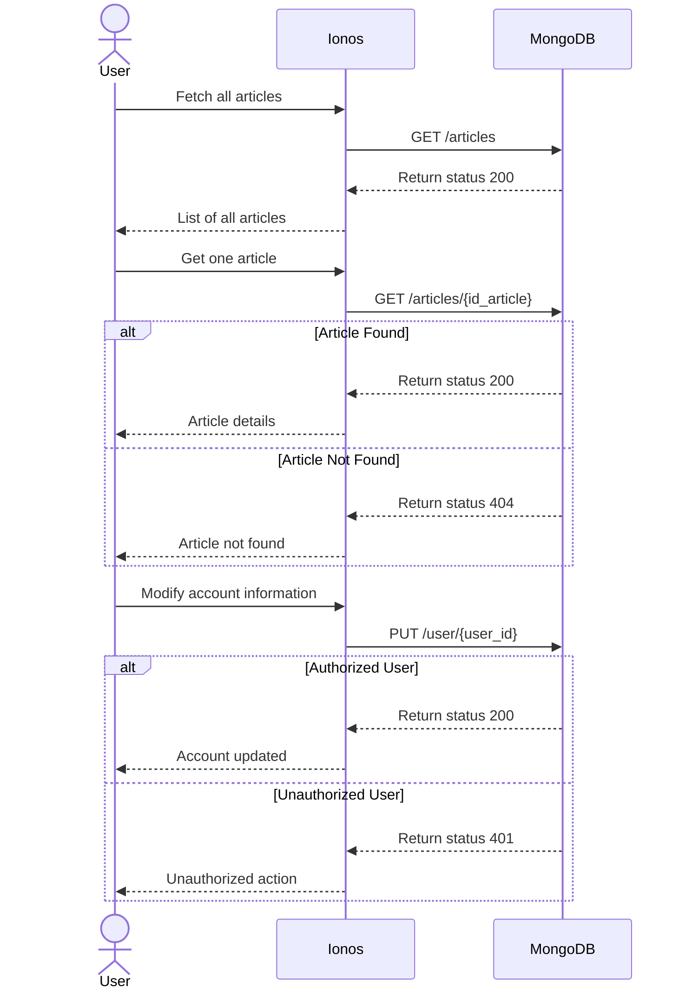
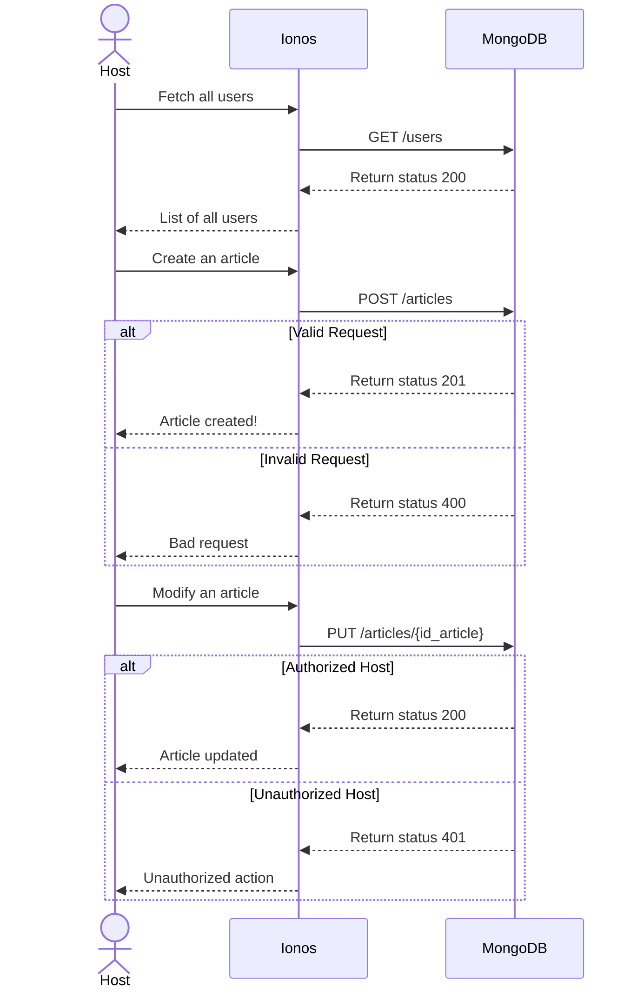
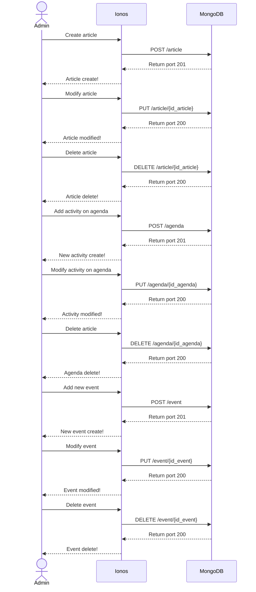

### Technical Documentation - Repaire des 2 Vallées !

---

# User Stories and Mockups 📚

## Prioritized User Stories 🚀

### **Must Have** ✅

* **User Stories**:

  * 👤 *As a user, I want to sign up and log in so that I can securely access my account.*
  * 📰 *As a user, I want to browse the association's articles so that I can stay informed.*
  * 📅 *As a user, I want to see which activities/articles I am enrolled in so that I know when to attend.*
  * 🔔 *As a user, I want to receive notifications for activity/article deadlines so that I never miss anything.*

### **Should Have** 💡

* **User Stories**:

  * 💻 *As an administrator, I want to manage the association's articles so that I can edit or delete them if necessary.*
  * 🧑‍🔧 *As a user, I want to collaborate with others by sharing projects so that we can work efficiently together.*
  * 🕗 *As a user, I want to integrate my calendar with the application so that I can synchronize my tasks across platforms.*
  * 🎨 *As a user, I want to customize my profile so that I can make my experience more personal.*

### **Could Have** 🌟

* **User Stories**:

  * 🌃 *As a user, I want a dark mode so that I can use the application comfortably in low-light environments.*

### **Won’t Have (Excluded from MVP)** ❌

* **User Stories**:

  * 🎤 *As a user, I want to use voice commands to find an activity so that I can search without using the keyboard.*
  * 🤖 *As a user, I want an AI assistant to help clients so that it can assist them if they encounter problems on the site.*

---

## Main Screen Mockups 🎨

### 🏠 Home Screen

### 🔐 Login/Sign-Up Screen

### 📜 Articles Page Preview

---

# Design System Architecture 🖌️

* **Frontend**: HTML, CSS
* **Backend**: Node.js, Express
* **Database**: MongoDB
* **External APIs**: Ionos

---

# Components, Classes, and Database Design 📊
## User Stories and Mockups

## Design System Architecture
front-end : HTML, CSS
back-end : node.js and express
database: mangoDb
api external : Ionos

## Components, Classes, and Database Design

### **Database Schema**:

* **Admin**:

  * `firstName`, `lastName`, `email`, `phoneNumber`, `role`, `password`, `id_admin`, `created_at`, `updated_at`
* **User**:

  * `firstName`, `lastName`, `role`, `email`, `address`, `password`, `phoneNumber`, `id_user`, `created_at`, `updated_at`
* **Agenda**:

  * `title`, `description`, `day`, `image` (optional), `price`, `id_agenda`, `created_at`, `updated_at`, `created_by`
* **Article**:

  * `title`, `description`, `date`, `image` (optional), `creator`, `id_article`, `created_at`, `updated_at`, `created_by`, `category`
* **Children**:

  * `firstName`, `lastName`, `age`
* **Event**:

  * `title`, `date`, `created_at`, `updated_at`, `image`, `id_event`

---

# High-Level Sequence Diagrams 📊

### **User Interaction**

### **Host Interaction**

### Admin part

---

# Document External and Internal APIs 🔗

### **User API**

| **URL**  | **Method**      | **input** (json)                 | **Output** (json)  | Description|
|------------|-----------------|---------------------------------|--------------|------------|
|api/user|POST|``{firsname, lastName, email, adress, phone}``|``{message: "Your acount are created!"}``| Creation of a user|
|api/auth/login | GET | ``{Email, Password}``|``{token}``| connection user acount|
|api/user/{id_user}|PUT|``{firsname, lastName, email, adress, phone, user_id}``|``{message: ""Your information have been modified"}``| Modify user account|
|api/user/{id_user}|DELETE|``{id_user}``|``{message: "your acount are been delete"}``| Delete the user acount |
|api/article| GET ||``{list of article}``| Get all article |
|api/article/{id_article} |GET|``{id_article}``|``{article}``|  Get a article with this id |
|api/agenda |GET||``{list of article}``| Get all activity on agenda |
|api/agenda/{id_agenda} |GET|``{id_agenda}``|``{activity}``| Get activy on agenda with this id |
|api/event |GET||``{list of event}``| Get all event |
|api/event/{id_event} |GET|``{id_event}``|``{event}``| Get a event with this id |

### **Host and admin API**

| **URL**  | **Method**      | **input** (json)                 | **Output** (json)  | description|
|------------|-----------------|---------------------------------|--------------|------------|
|api/admin/user|GET||``{list of user}``| Admin see all user |
|api/admin/user/{id_user}|GET|``{id_user}``|``{User info}``| Admin see one user with this id|
|api/admin/user/{id_user}|PUT|``{firsname, lastName, email, adress, phone, id_user, id_admin}``| ``{message: "the user info have been modified"}``| admin modified the user data |
|api/admin/user/{id_user}|DELETE|``{id_user}``|``{message: "the acount user are delete"}``| Admin delete the user acount|
|api/admin/article| POST |``{titre, description, date, image (optionnal)}``|``{message: "Your article are create !"}``| Admin create a article |
|api/admin/article/{id_article} |PUT|``{titre, description, date, image (optionnal)}``|``{message: "Your article are update !"}``|Admin modified the article |
|api/admin/article/{id_article} |DELETE|``{id_article}``|``{message: "Your article are delete!"}``|  Admin delete the article|
|api/admin/agenda |POST|``{titre, description, date, picture (optionnal)}``|``{message: "Your activity are create !"}``| Admin create a activity on agenda |
|api/admin/agenda/{id_agenda} |PUT|``{id_agenda, titre, description, date, image (optionnal)}``|``{message: "Your activity are update !"}``|Admin modified the activity agenda |
|api/admin/agenda/{id_agenda} |DELETE|``{id_agenda}``|``{message: "Your activity are delete !"}``|  Admin delete activity on the agenda|
|api/event |GET||``{list of event}``| Get all event |
|api/event/{id_event} |GET|``{id_event}``|``{title, description, date, image}``| Get a event with this id |
|api/admin/event |POST|``{titre, description, date, image (optionnal)}``|``{message: "Your event are create !"}``| Admin create a event |
|api/admin/event/{id_event} |PUT|``{id_agenda, titre, description, date, image (optionnal)}``|``{message: "Your event are update !"}``|Admin modified the event |
|api/admin/event/{id_event} |DELETE|``{id_agenda}``|``{message: "Your event are delete !"}``|  Admin delete the event|

---

# Plan SCM and QA Strategies 🛠️

### **SCM Strategy**

* **Version Control**: Git
* **Branching Strategy**:

  * `main`: Stable, production-ready code
  * `development`: Integration branch for features/bug fixes
  * `feature/*`: Feature branches for individual tasks
  * `hotfix/*`: For urgent fixes
* **Commit Guidelines**: Use a standardized format, e.g., `feat: Add feature` or `fix: Correct issue`

### **Quality Assurance**

* **Testing Types**:

  * Unit Tests: Individual components (e.g., API endpoints)
  * Integration Tests: Modules working together
  * End-to-End Tests: User workflows
  * Manual Tests: Critical user flows/UI validation
 
* **SCM (Software Configuration Management)**:

* Version Control: Git to manage project versioning.

  * Branches:

    * main: Production-ready code.

    * test: Branch for ongoing integration and development.

    * bryan/*, cyprien/*: Individual branches to develop specific features.

    * test/*: Branches to quickly fix bugs in production.
    
    * Git Workflow: Use a methodology like GitFlow or GitHub Flow to structure collaborative development.
      
* **Unit Tests:**

  * **Backend (Node.js):**
    * **Jest**: Ideal for testing isolated JavaScript functions.  
      * Example: Test REST API endpoints to ensure expected data is returned.  
    * **Mocha + Chai**: Alternative for writing clear and understandable tests.

  * **Frontend (HTML/CSS):**
    * **W3C Validator**: Validate HTML syntax.  
    * **stylelint**: Detect CSS style errors.

* **Integration Tests:**

  * **Backend (Node.js):**
    * **Supertest + Jest**: Test API route integrations.  
      * Example: Validate API calls interact correctly with the database.

  * **Frontend:**
    * **Postman**: Simulate API requests to test communication between frontend and backend.

* **End-to-End (E2E) Tests:**

  * **Tools:**
    * **Cypress**: Best for testing complete user flows in simple web applications.  
      * Example: Verify form submission and data transfer to the backend.  
    * **Playwright/Puppeteer**: Alternatives for lightweight E2E testing.

* **Environments:**

  * **Test Environment:**
    * Isolated Node.js server with a mock database (e.g., SQLite in memory or test MongoDB).  
    * Local hosting for HTML/CSS files to test interactions.

  * **Production Environment:**
    * Ensure static code analysis using **ESLint** before deployment.  
    * Monitor performance and errors with tools like **New Relic**.

## Technical Justifications 🧐  

We goes with a classique technologie for these raison :
- Repaire des 2 Vallées is a small association, so we don't need a large hosting provider.
- We use simple technology if the association is hiring developers.
- Given the small number of possible users, we use a simple database.
- We use Mango DB for the database because it's easy to use and configure, and our target audience is parents of children.
- We use simple technologies like HTML, CSS, and Node.js to make it easier for another developer to take over in the future.
- We use Git for version control because we need to be able to roll back and share work with other team members.
- We use Ionos hosting because it was requested directly by the Repaire des 2 Vallées association.
--- 
